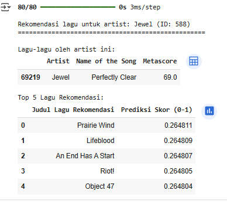
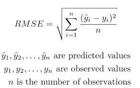

# Laporan Proyek Sistem Rekomendasi - TAUFIK ALWAN

Di era digital saat ini, teknologi *machine learning* menjadi salah satu pilar utama dalam proses pengolahan dan analisis data. Teknologi ini mampu memberikan solusi efektif dalam berbagai permasalahan, termasuk dalam sistem rekomendasi. Sistem rekomendasi bertujuan untuk memberikan saran atau pilihan yang paling sesuai bagi pengguna, berdasarkan preferensi atau riwayat interaksi mereka sebelumnya.

Teknologi rekomendasi telah banyak diimplementasikan di berbagai platform, seperti media sosial yang menyajikan konten sesuai minat pengguna, maupun marketplace yang menawarkan produk berdasarkan preferensi pembeli. Perusahaan besar seperti Amazon, Netflix, dan Spotify juga telah mengadopsi sistem rekomendasi dalam skala global untuk meningkatkan pengalaman pengguna mereka.

Proyek ini bertujuan untuk mengembangkan model sistem rekomendasi lagu yang mampu memberikan saran musik yang relevan kepada pengguna. Pengembangan model ini berfokus pada dua pendekatan utama dalam *machine learning*, yaitu *Content-Based Filtering* dan *Collaborative Filtering*. Proyek ini dianggap penting karena dapat membantu pengguna dalam memilih lagu berdasarkan kebiasaan mendengarkan mereka sebelumnya, sekaligus membandingkan efektivitas kedua pendekatan dalam menghasilkan rekomendasi yang paling akurat.

Dengan kehadiran sistem rekomendasi yang tepat dan efisien, pengguna akan lebih mudah dalam mengambil keputusan untuk memilih lagu yang ingin mereka dengarkan, sehingga pengalaman penggunaan aplikasi menjadi lebih personal dan menyenangkan. Penelitian ini juga merujuk pada beberapa studi sebelumnya yang relevan, antara lain:

* *Menakar Preferensi Musik di Kalangan Remaja: Antara Musik Populer dan Musik Klasik*, yang menyoroti kecenderungan remaja dalam memilih genre musik tertentu.
* *Pengembangan Sistem Rekomendasi Berbasis Kecerdasan Buatan untuk Meningkatkan Pengalaman Pengguna di Platform E-Commerce*, yang menekankan pentingnya penerapan AI dalam meningkatkan kenyamanan pengguna di e-commerce.
* *Pemanfaatan Sistem Rekomendasi Menggunakan Content-Based Filtering pada Hotel di Palangka Raya*, yang menunjukkan efektivitas pendekatan Content-Based dalam menyajikan rekomendasi akurat.
* *Preferensi Musik di Kalangan Remaja*, yang menjelaskan bahwa berbagai faktor turut memengaruhi ketertarikan seseorang terhadap genre musik tertentu.

---
---

### 🔍 Kelebihan dan Kekurangan Content-Based Filtering (CBF) & Collaborative Filtering (CF)

#### Content-Based Filtering (CBF)

**Kelebihan:**

* Tidak bergantung pada data interaksi pengguna seperti rating, cukup menggunakan informasi dari konten lagu (misalnya judul).
* Tetap dapat memberikan rekomendasi meskipun hanya ada satu data lagu (cocok untuk pengguna baru).
* Lebih mudah diterapkan dan prosesnya relatif cepat.

**Kekurangan:**

* Hanya merekomendasikan lagu-lagu yang serupa dengan yang telah dikenal, sehingga kurang mampu memahami preferensi musik yang lebih bervariasi.
* Bergantung sepenuhnya pada fitur konten seperti judul lagu, yang bisa sangat terbatas dalam menggambarkan keseluruhan karakteristik lagu.

---

#### Collaborative Filtering (CF)

**Kelebihan:**

* Dapat mengenali pola preferensi pengguna dari data interaksi (misalnya hubungan antara artis dan lagu melalui rating).
* Rekomendasi yang dihasilkan lebih personal karena mempertimbangkan hubungan antar pengguna dan item.
* Mampu merekomendasikan lagu-lagu yang secara konten tidak mirip, namun disukai oleh pengguna dengan selera serupa.

**Kekurangan:**

* Memerlukan data interaksi dalam jumlah yang besar agar model bisa bekerja dengan baik.
* Lebih kompleks dalam penerapan, karena membutuhkan proses pelatihan model yang lebih rumit seperti penggunaan neural network.

---
---

## ⚠️ Rumusan Masalah

Penelitian ini dilatarbelakangi oleh beberapa permasalahan utama yang ingin diselesaikan, yaitu:

1. **Bagaimana sistem rekomendasi dapat memberikan saran lagu yang relevan berdasarkan kemiripan konten, seperti judul lagu, dan sejauh mana relevansi tersebut tercermin melalui hasil evaluasi model?**

2. **Bagaimana sistem dapat memberikan rekomendasi lagu secara personal kepada pengguna berdasarkan preferensi artis favorit sebelumnya, serta seberapa akurat model dalam memprediksi penilaian terhadap lagu yang belum pernah didengarkan oleh pengguna tersebut?**

---

---

## ✨ Tujuan Penelitian

Berdasarkan rumusan masalah yang telah dikemukakan, tujuan dari penelitian ini adalah sebagai berikut:

1. **Menentukan model sistem rekomendasi yang efektif dalam memberikan saran lagu yang relevan kepada pengguna.**

2. **Melakukan perbandingan antara beberapa pendekatan sistem rekomendasi untuk memperoleh solusi terbaik dalam konteks rekomendasi lagu yang personal dan akurat.**

---

---

## 💡 Pendekatan Solusi

Untuk menjawab permasalahan yang telah diidentifikasi, penelitian ini menggunakan pendekatan berbasis *machine learning* dalam membangun sistem rekomendasi lagu. Dua metode utama yang digunakan adalah **Content-Based Filtering** dan **Collaborative Filtering**.

Pada pendekatan *Collaborative Filtering*, penelitian ini memanfaatkan teknik *neural network* guna meningkatkan kemampuan model dalam memahami preferensi pengguna berdasarkan interaksi sebelumnya. Sementara itu, *Content-Based Filtering* digunakan untuk merekomendasikan lagu berdasarkan kemiripan konten, seperti kemiripan judul lagu atau atribut lainnya.

Proses pengembangan sistem dilakukan melalui beberapa tahapan penting, meliputi:

* Pengumpulan dan pengolahan data,
* Eksplorasi dan ekstraksi fitur,
* Pemilihan serta penerapan algoritma rekomendasi, dan
* Evaluasi performa model untuk memastikan tingkat akurasi dan relevansi rekomendasi yang optimal.

Pendekatan ini diharapkan mampu memberikan rekomendasi lagu yang relevan dan personal bagi setiap pengguna.

---

---

## 📑 Pemahaman Data (*Data Understanding*)

Dataset yang digunakan dalam penelitian ini merupakan kumpulan data lagu yang terorganisir dengan baik dan diperoleh dari platform **Kaggle** dengan nama **"Song Dataset"**. Dataset ini berisi informasi penting mengenai lagu-lagu yang dapat digunakan untuk membangun sistem rekomendasi.

Adapun variabel-variabel yang terdapat dalam dataset tersebut antara lain:

* **Name of the Song**: Berisi nama atau judul dari masing-masing lagu.
* **Artist**: Menunjukkan nama artis atau penyanyi dari lagu tersebut.
* **Date of Release**: Mencatat tanggal resmi perilisan lagu.
* **Description**: Berisi deskripsi atau ringkasan informasi mengenai lagu, termasuk genre, tema, atau narasi umum.
* **Metascore**: Merupakan skor evaluasi rata-rata yang diberikan oleh para kritikus musik terhadap lagu tersebut.
* **User Score**: Menunjukkan skor atau penilaian dari pengguna umum berdasarkan preferensi dan pengalaman mereka terhadap lagu.

Pemahaman terhadap struktur dan isi dari dataset ini menjadi langkah awal yang krusial dalam proses analisis, pemodelan, serta pengembangan sistem rekomendasi lagu berbasis *machine learning*.

---

---
### Proses analisis data
## 🔍 Eksplorasi Awal dan Pembersihan Data

Untuk memahami kondisi awal dataset, beberapa fungsi eksploratif pada *Pandas* digunakan:

* `df.info()` memberikan gambaran umum tentang struktur dataset, termasuk jumlah baris dan kolom, tipe data tiap kolom, serta jumlah nilai non-null.
* `df.isnull().sum()` digunakan untuk mengidentifikasi jumlah nilai kosong (*missing values*) pada setiap kolom.
* `df.duplicated().sum()` digunakan untuk memeriksa jumlah duplikasi baris secara keseluruhan dalam dataset.
* `df.duplicated(subset=['Name of the Song']).sum()` mengecek jumlah lagu yang memiliki judul yang sama, untuk mengetahui potensi duplikasi berdasarkan nama lagu.

### 📌 Hasil Pengamatan

Berdasarkan eksplorasi awal, diperoleh hasil sebagai berikut:

* **Jumlah total entri** dalam dataset adalah **198.126 baris**.
* **Missing values** ditemukan pada beberapa kolom:

  * `Description`: terdapat **4.369** data kosong.
  * `Metascore`: terdapat **24.385** data kosong.
  * `User Score`: terdapat **49.281** data kosong.
* **Jumlah baris yang duplikat secara keseluruhan**: **0** baris (tidak ditemukan duplikasi identik pada seluruh baris).
* **Jumlah lagu dengan nama judul yang duplikat**: sebanyak **194.214 lagu**, menunjukkan bahwa banyak lagu memiliki judul yang sama, kemungkinan besar berasal dari artis atau versi yang berbeda.

Temuan ini menjadi landasan penting untuk proses *data cleaning* dan validasi data sebelum melanjutkan ke tahap pemodelan.

---
### Visualisasi Data
Beberapa teknik visualisasi digunakan untuk memahami distribusi data antara lain:
- **Histogram**: Digunakan untuk melihat distribusi frekuensi data dalam tiap variabel.


## 🧹 Persiapan Data untuk *Content-Based Filtering* dan *Collaborative Filtering*

---

Sebelum masuk ke tahap pemodelan, data perlu dipersiapkan dan dibersihkan agar sesuai dengan kebutuhan algoritma *machine learning*, khususnya untuk sistem rekomendasi berbasis **Content-Based Filtering** dan **Collaborative Filtering**.

### 🔧 Langkah-langkah Data Preparation:

1. **Menghapus Data yang Tidak Lengkap (Missing Values)**
   Data yang memiliki nilai kosong dihapus menggunakan fungsi `dropna()`. Hal ini penting untuk menjaga kualitas data dalam proses pelatihan model.

2. **Menghapus Duplikasi Berdasarkan Judul Lagu**
   Untuk menghindari redudansi pada hasil rekomendasi, data duplikat berdasarkan kolom **Name of the Song** dihapus menggunakan `drop_duplicates()`.

```python
# Menghapus missing values dan duplikasi berdasarkan judul lagu
df_songs.dropna(inplace=True)
df_songs.drop_duplicates(subset=['Name of the Song'], inplace=True)

# Menampilkan jumlah data setelah dibersihkan
print(f"Jumlah data setelah dibersihkan: {len(df_songs)} baris")
```

3. **Pembersihan Kolom Artist**
   Ditemukan bahwa pada kolom `Artist`, nama artis sering diawali dengan kata **"by"** (misalnya: `"by Taylor Swift"`). Untuk menjaga konsistensi dalam analisis teks dan pencocokan string, kata “by” dihapus menggunakan *regular expression*.

```python
# Salin data ke dataframe baru untuk proses encoding/pembersihan
df_songs_encode = df_songs.copy()

# Bersihkan kolom 'Artist' dengan menghapus kata 'by' di awal jika ada
df_songs_encode['Artist'] = df_songs_encode['Artist'].str.replace(r'^by\s+', '', regex=True).str.strip()

# Tampilkan hasil dataframe yang telah diproses
display(df_songs_encode.head())
```
* Setelah proses pembersihan, diperoleh **2.537 entri data lagu** dengan **7 atribut** yang siap digunakan untuk pemodelan.
* Proses pembersihan kolom `Artist` bertujuan menghindari kesalahan dalam analisis atau pencocokan nama artis.
* Dengan data yang bersih dan terstruktur, proses *Content-Based Filtering* dan *Collaborative Filtering* dapat dilakukan secara optimal dan akurat.
---
### 1. Data Preparation Content Base Filtering
Data preparation untuk Content Base Filtering didasari pada :
- Membuang atribut **Description, Unnamed: 0, dan Date of Release**. Tujuan dari pembuangan atribut ini untuk mempersiapkan atribut yang akan digunakan pada proses CBF.
- TF-IDF digunakan untuk mengubah judul lagu menjadi representasi numerik.
```python
# Salin ulang data hasil pembersihan nama artis
df_songs = df_songs_encode.copy()

# Kolom yang ingin dihapus
drop_columns = ['Description', 'Unnamed: 0', 'Date of Release']

# Hapus kolom jika memang ada dalam DataFrame
df_songs.drop(columns=[col for col in drop_columns if col in df_songs.columns], inplace=True)

# Tampilkan hasil
display(df_songs)
```
- **`TfidfVectorizer(stop_words='english')`**  
  Digunakan untuk menghilangkan kata-kata umum (seperti "the", "of", "and") agar hanya kata penting yang digunakan sebagai fitur.

- **`fit_transform(df_songs['Name of the Song'])`**  
  Melatih dan mentransformasi kolom judul lagu menjadi matriks TF-IDF.

- **`tfidf_matrix.shape` → (2537, 2858)**  
  Artinya ada **2.537 lagu unik** yang direpresentasikan oleh **2.858 kata unik** yang muncul pada judul lagu (setelah dibersihkan dan difilter).

- **`tfidf_matrix.todense()`**  
  Mengubah representasi sparse matrix (hemat memori) ke dense matrix agar dapat dilihat dan dianalisis secara eksplisit.
```python
# Inisialisasi TF-IDF Vectorizer
tfidf_vectorizer = TfidfVectorizer(stop_words='english')  # stop_words digunakan untuk menghilangkan kata umum yang tidak penting

# Transformasi kolom 'Name of the Song' menjadi representasi TF-IDF
tfidf_matrix = tfidf_vectorizer.fit_transform(df_songs['Name of the Song'])

# Menampilkan ukuran matriks TF-IDF (baris = jumlah lagu, kolom = jumlah fitur unik dari judul lagu)
print(f"Ukuran TF-IDF Matrix: {tfidf_matrix.shape}")
```
### 2. Data Preparation Collaborative Filtering
Pada tahap ini, kita melakukan serangkaian proses transformasi dan normalisasi terhadap dataset lagu df_songs untuk mempersiapkannya sebelum digunakan dalam model prediktif seperti regresi atau neural network.

Langkah-langkah yang Dilakukan:
Normalisasi Nilai Rating (Metascore) 🎵

Skor metascore setiap lagu dinormalisasi ke dalam rentang 0 hingga 1 menggunakan min-max scaling.
Tujuan: agar model tidak bias terhadap skala nilai asli yang besar dan menjaga kestabilan selama pelatihan.
Penggabungan Fitur (X) 🎤🎶

Kolom Artist dan Name of the Song digunakan sebagai fitur numerik setelah label encoding sebelumnya.
Digabung menjadi satu array x yang kemudian dinormalisasi menggunakan MinMaxScaler agar semua fitur berada dalam skala yang seragam.
Pemisahan Dataset 📊

Dataset dibagi menjadi 80% data latih dan 20% data validasi.
Hal ini penting untuk mengevaluasi kinerja model secara obyektif terhadap data yang belum pernah dilihat sebelumnya
```python
# Target tetap menggunakan Metascore
min_rating = df_songs['Metascore'].min()
max_rating = df_songs['Metascore'].max()
y = df_songs['Metascore'].apply(lambda val: (val - min_rating) / (max_rating - min_rating)).values

# Tambahkan User Score sebagai fitur tambahan
x = df_songs[['Artist', 'Name of the Song', 'User Score']].values

# Normalisasi semua fitur
scaler_x = MinMaxScaler()
x_scaled = scaler_x.fit_transform(x)

# Split
split_index = int(0.8 * len(df_songs))
x_train, x_val = x_scaled[:split_index], x_scaled[split_index:]
y_train, y_val = y[:split_index], y[split_index:]

print("Fitur (x):", x_scaled.shape)
print("Target (Metascore y):", y.shape)
```

## Modeling and Result
Proses modeling memuat proses perancangan model yang digunakan dalam rekomendasi.

### Content Base Filtering

```python
# Menghitung Cosine Similarity dari matrix TF-IDF
cosine_sim = cosine_similarity(tfidf_matrix, tfidf_matrix)
# Menampilkan ukuran matriks kemiripan (harus persegi: jumlah lagu x jumlah lagu)
print(f"Ukuran matriks Cosine Similarity: {cosine_sim.shape}")
```

### Solusi - Top 5 rekomendasi pada teknik Content Base Filtering
- Membuat DataFrame dari matriks cosine similarity
Cosine similarity digunakan untuk mengukur tingkat kemiripan antara satu lagu dengan lagu lainnya berdasarkan vektor TF-IDF dari judul lagu. Hasil dari perhitungan ini adalah matriks simetri berukuran n x n, di mana n adalah jumlah lagu. Setiap nilai dalam matriks menunjukkan tingkat kemiripan antara dua lagu. Untuk memudahkan pencarian dan penyajian rekomendasi, matriks ini kemudian diubah menjadi sebuah DataFrame, sehingga setiap lagu dapat dihubungkan langsung dengan skor kemiripannya terhadap lagu lainnya. Baris dan kolom menggunakan nama lagu untuk kemudahan interpretasi

```python
cosine_sim_df = pd.DataFrame(
    cosine_sim,
    index=df_songs['Name of the Song'],
    columns=df_songs['Name of the Song']
)
```
Menampilkan ukuran dari DataFrame hasil cosine similarity
- DataFrame ini sangat penting dalam proses rekomendasi.
- Contoh: Jika pengguna menyukai lagu A, maka sistem dapat merekomendasikan lagu-lagu lain yang memiliki nilai cosine similarity tinggi terhadap lagu A.
```python
print(f" Ukuran DataFrame cosine similarity: {cosine_sim_df.shape}")
```
Menampilkan 10 sampel baris dan 10 kolom dari cosine similarity matrix
```python
cosine_sim_df.sample(n=10, axis=0).sample(n=10, axis=1)
```
Fungsi `song_recommendations()` digunakan untuk memberikan rekomendasi lagu-lagu yang memiliki kemiripan tertinggi berdasarkan **judul lagu**, menggunakan pendekatan **Content-Based Filtering (CBF)** dengan perhitungan **Cosine Similarity**.
```python
def song_recommendations(target_song, similarity_data=cosine_sim_df, items=df_songs[['Name of the Song', 'Artist']], k=5):
    if target_song not in similarity_data.columns:
        raise ValueError(f"Lagu '{target_song}' tidak ditemukan dalam data.")
    similar_scores = similarity_data[target_song].sort_values(ascending=False)[1:k+1]
    recommendations = pd.DataFrame(similar_scores).reset_index()
    recommendations.columns = ['Name of the Song', 'Similarity Score']
    recommendations = recommendations.merge(items, on='Name of the Song')
    return recommendations
```

### 🎵 Hasil Rekomendasi Menggunakan *Content-Based Filtering*

Melalui pendekatan *Content-Based Filtering*, sistem menghasilkan rekomendasi lagu berdasarkan kemiripan kata yang terkandung dalam judul lagu yang dicari oleh pengguna. Sistem ini akan menampilkan **5 lagu terdekat** yang memiliki kesamaan konten tertinggi dengan lagu referensi.

* 
* 
* 
  
---

### Collaborative Filtering

- Collaborative filtering dikembangkan menggunakan model neural network yang dibangun dengan bantuan TensorFlow dan Keras. Dalam proses ini, dibuat embedding vektor berdimensi untuk masing-masing artis dan lagu guna menangkap pola hubungan di antara identitas tersebut.
- Kita membuat vektor angka (embedding) untuk artist dan lagu supaya model bisa memahami hubungan antar keduanya.
- Kemudian, dilakukan perkalian antar vektor (dot product) antara embedding artist dan lagu untuk menghitung seberapa cocok keduanya.

---
Bagian ini membuat representasi vektor (*embedding*) untuk setiap **artist** dan bias-nya agar bisa dihitung kemiripannya dengan lagu.
```python
self.artist_embedding = layers.Embedding(
    input_dim=num_artists,
    output_dim=embedding_size,
    embeddings_initializer='he_normal',
    embeddings_regularizer=regularizers.l2(1e-6)
)
self.artist_bias = layers.Embedding(input_dim=num_artists, output_dim=1)
```
---

Membuat representasi vektor (*embedding*) untuk setiap **lagu** dan bias-nya, mirip seperti artist.

```python
self.song_embedding = layers.Embedding(
    input_dim=num_songs,
    output_dim=embedding_size,
    embeddings_initializer='he_normal',
    embeddings_regularizer=regularizers.l2(1e-6)
)
self.song_bias = layers.Embedding(input_dim=num_songs, output_dim=1)
```
---

Bagian ini mendefinisikan layer tambahan (Dense dan Dropout) untuk memproses hasil kombinasi embedding dan skor user.
```python
self.concat_dense = layers.Dense(64, activation='relu')
self.dropout = layers.Dropout(0.3)
self.output_layer = layers.Dense(1, activation='sigmoid')  # karena target sudah dinormalisasi
```
---

Mengambil input artist, lagu, dan skor user (dalam bentuk float).
```python
artist_input = tf.cast(inputs[:, 0], tf.int32)
song_input = tf.cast(inputs[:, 1], tf.int32)
user_score = tf.expand_dims(inputs[:, 2], axis=1)
```
---

Mengambil representasi vektor dari artist dan lagu berdasarkan ID input.
```python
artist_vec = self.artist_embedding(artist_input)
song_vec = self.song_embedding(song_input)
artist_bias = self.artist_bias(artist_input)
song_bias = self.song_bias(song_input)
```
---
Mengalikan vektor artist dan lagu secara elemen (element-wise) lalu menjumlahkannya untuk mendapat skor kecocokan.
```python
dot = tf.reduce_sum(artist_vec * song_vec, axis=1, keepdims=True)
x = dot + artist_bias + song_bias
```
---

Menggabungkan skor prediksi dengan skor asli dari user.

```python
combined = tf.concat([x, user_score], axis=1)
```
---

Memproses hasil gabungan untuk menghasilkan skor akhir antara 0–1.

```python
x = self.concat_dense(combined)
x = self.dropout(x)
output = self.output_layer(x)
```
---
Model ini dikompilasi menggunakan MSE (Mean Squared Error) sebagai fungsi kerugian (loss function), dan RMSE (Root Mean Squared Error) digunakan sebagai metrik untuk mengevaluasi performa model.
```python
model.compile(
    loss=tf.keras.losses.MeanSquaredError(),
    optimizer=tf.keras.optimizers.Adam(learning_rate=0.001),
    metrics=[tf.keras.metrics.RootMeanSquaredError()]
)
```
Dalam proses pelatihan model rekomendasi, digunakan beberapa teknik callback yang bertujuan untuk meningkatkan efisiensi dan stabilitas model:

1. **Custom Callback (`myCallback`)**

- Menghentikan training secara otomatis jika **RMSE** turun di bawah **0.05**.
- Ini membantu **menghindari overtraining** saat model sudah cukup baik.
```python
class myCallback(tf.keras.callbacks.Callback):
    def on_epoch_end(self, epoch, logs={}):
        rmse = logs.get('root_mean_squared_error')
        if rmse is not None and rmse < 0.05:
            print(f"\nRMSE telah mencapai < 0.05! (RMSE: {rmse:.4f})")
            self.model.stop_training = True
callbacks = myCallback()
```

2. **EarlyStopping**
   - Memantau metrik `val_root_mean_squared_error`.
   - Jika tidak ada peningkatan selama **10 epoch berturut-turut**, training akan dihentikan.
   - Opsi `restore_best_weights=True` memastikan bobot terbaik dikembalikan.
```python
     early_stop = tf.keras.callbacks.EarlyStopping(
    monitor='val_root_mean_squared_error',
    patience=10,
    restore_best_weights=True,
    verbose=1
)
```

3. **ReduceLROnPlateau**
   - Mengurangi *learning rate* sebesar 50% jika `val_loss` stagnan selama **5 epoch**.
   - Membantu model melanjutkan pelatihan dengan pembaruan parameter yang lebih halus (fine-tuning).
```python
   history = model.fit(
    x = x_train,
    y = y_train,
    batch_size = 64,
    epochs = 100,
    callbacks=[callbacks, early_stop, reduce_lr],
    validation_data = (x_val, y_val),
    verbose=1
)
```
#### Parameter Pelatihan:
* **Batch size:** 64
* **Epochs maksimum:** 100
* **Data:** Sudah dibagi menjadi training dan validation

### Solusi - Top 5 rekomendasi pada teknik Collaborative Filtering

```python
def rekomendasi_lagu_untuk_artis(model, df_songs, artist_encoder, song_encoder, userscore_encoder, top_k=5):
   
    artist_id = df_songs.Artist.sample(1).iloc[0]
    songs_by_artist = df_songs[df_songs.Artist == artist_id]
    songs_not_by_artist = df_songs[~df_songs['Name of the Song'].isin(songs_by_artist['Name of the Song'].values)]
    songs_not_by_artist_ids = songs_not_by_artist['Name of the Song'].values

    artist_song_array = np.hstack(
        ([[artist_id]] * len(songs_not_by_artist_ids), songs_not_by_artist_ids.reshape(-1, 1))
    )

    original_user_scores = userscore_encoder.inverse_transform(df_songs['User Score'] - 1)
    default_user_score = original_user_scores.mean()

    min_metascore = df_songs_encode['Metascore'].min()
    max_metascore = df_songs_encode['Metascore'].max()
    scaled_default_user_score = (default_user_score - min_metascore) / (max_metascore - min_metascore)

    user_scores = np.full((artist_song_array.shape[0], 1), scaled_default_user_score)

    input_array = np.hstack((artist_song_array, user_scores))

    ratings = model.predict(input_array).flatten()

    top_ratings_indices = ratings.argsort()[-top_k:][::-1]
    recommended_song_ids = songs_not_by_artist_ids[top_ratings_indices]
    recommended_scores = ratings[top_ratings_indices]

    artist_name = artist_encoder.inverse_transform([artist_id - 1])[0] 
    recommended_song_titles = song_encoder.inverse_transform(recommended_song_ids.astype(int) - 1)
```
Pada tahap ini, sistem rekomendasi digunakan untuk **memprediksi lagu-lagu yang relevan bagi seorang artis tertentu**, berdasarkan histori lagu-lagu yang pernah dibuat artis tersebut dan pola hubungan dengan lagu-lagu lainnya.

1. **Pilih Artis Secara Acak**

   * Diambil satu `Artist ID` secara acak dari dataset.

2. **Identifikasi Lagu**

   * Dipisahkan lagu-lagu yang **pernah** dibuat oleh artis tersebut.
   * Dihitung kemungkinan kecocokan terhadap **lagu-lagu yang belum pernah dibuat** oleh artis itu.

3. **Prediksi dengan Model**

   * Model `RecommenderNet` digunakan untuk memprediksi **skor kecocokan** antara artis dan setiap lagu.

4. **Rekomendasi Lagu**

   * Diambil **5 lagu teratas** dengan skor tertinggi.
   * Lagu ditampilkan bersama nilai skor prediksi (0–1).

#### Output

* Tampilkan **lagu-lagu terbaik** dari artis berdasarkan `Metascore`.
* Berikan **5 lagu rekomendasi** yang belum pernah dibuat oleh artis, disertai prediksi skor.

  

## 🔍 Evaluation
### Evaluasi Content Based Filtering
```python
Evaluasi dilakukan dengan mengukur precision, yaitu seberapa tepat rekomendasi yang diberikan oleh model.
Penghitungan precision ini dilakukan melalui perintah tertentu dalam kode.
# Fungsi tokenisasi: ubah teks menjadi kumpulan kata unik (huruf kecil, tanpa tanda baca)
def tokenisasi(teks):
    return set(re.findall(r'\b\w+\b', teks.lower()))

# Fungsi untuk mengukur presisi rekomendasi berdasarkan token judul lagu
def presisi_untuk_lagu_acak(data_lagu, matriks_similarity, k=3):
    # Pilih lagu target secara acak
    lagu_target = data_lagu['Name of the Song'].drop_duplicates().sample(n=1).values[0]
    print(f"Lagu target yang dipilih secara acak: **{lagu_target}**")

    # Validasi: pastikan lagu target tersedia dalam matriks similarity
    if lagu_target not in matriks_similarity.columns:
        print(f" Lagu '{lagu_target}' tidak ditemukan dalam matriks similarity.")
        return None, None

    # Ambil top-k rekomendasi
    try:
        rekomendasi_df = song_recommendations(lagu_target, similarity_data=matriks_similarity, k=k)
    except Exception as e:
        print(f" Terjadi kesalahan saat mengambil rekomendasi: {e}")
        return None, None

    # Tokenisasi judul lagu target
    token_target = tokenisasi(lagu_target)
    if not token_target:
        print(f" Judul lagu target '{lagu_target}' tidak memiliki token yang valid.")
        return None, None

    # Evaluasi kesamaan token dengan lagu hasil rekomendasi
    jumlah_relevan = sum(
        bool(token_target & tokenisasi(judul))
        for judul in rekomendasi_df['Name of the Song']
    )

    # Hitung nilai presisi
    presisi = jumlah_relevan / k
    print(f"\n Presisi rekomendasi untuk lagu '{lagu_target}': **{presisi:.2f}**")

    # Tambahkan kolom target ke hasil
    rekomendasi_df.insert(0, "Judul Lagu Target", lagu_target)
```
---

## Penjelasan Fungsi Evaluasi Presisi Rekomendasi

### 1. Fungsi `tokenisasi(teks)`

Fungsi ini mengubah teks menjadi kumpulan kata unik:

* Semua huruf diubah menjadi huruf kecil.
* Tanda baca dihilangkan.
* Hasilnya adalah *set* kata.

Contoh: `"I Love You!"` → `{"i", "love", "you"}`

---

### 2. Fungsi `presisi_untuk_lagu_acak()`

Digunakan untuk menghitung **presisi rekomendasi lagu** berdasarkan kemiripan kata dalam judul lagu.

Langkah-langkah prosesnya:

1. Memilih **satu lagu secara acak** dari data.
2. Memastikan lagu tersebut tersedia di **matriks similarity**.
3. Mengambil **rekomendasi top-*k*** lagu yang paling mirip.
4. Melakukan **tokenisasi** pada judul lagu target dan judul lagu-lagu yang direkomendasikan.
5. Menghitung **jumlah rekomendasi yang relevan**, yaitu yang memiliki minimal satu kata yang sama dengan lagu target.
6. Menghitung **nilai presisi** sebagai:
7. Menampilkan nilai presisi dan tabel rekomendasi.

### 🎵 **Hasil Rekomendasi Lagu Berdasarkan Kesamaan Judul**

Lagu target yang dipilih secara acak: Summer Of Hate
(**Bisa berubah2 jika dijalan kan ulang**)

**Presisi rekomendasi untuk lagu ini: 1.00**

#### Contoh Top-5 Lagu yang Direkomendasikan:

| No | Judul Lagu Rekomendasi  | Similarity Score | Artist                |
| -- | ----------------------- | ---------------- | --------------------- |
| 1  | Hate                    | 0.739            | The Delgados          |
| 2  | Summer Sun              | 0.497            | Yo La Tengo           |
| 3  | Summer In Abaddon       | 0.440            | Pinback               |
| 4  | Summer In The Southeast | 0.440            | Bonnie "Prince" Billy |
| 5  | How I Long To Feel...   | 0.349            | Gorky’s Zygotic Mynci |
---
---
### Evaluasi Collaborative Filtering
Evaluasi terhadap metode Collaborative Filtering dilakukan dengan menggunakan metrik **RMSE (Root Mean Squared Error)**, yaitu dengan membandingkan nilai aktual (*y\_true*) dan hasil prediksi model (*y\_pred*).


* **RMSE** dianggap tepat untuk mengevaluasi Collaborative Filtering karena metrik ini menghitung seberapa jauh prediksi model dari nilai sebenarnya.
* Hasil evaluasi menunjukkan **nilai RMSE sebesar 0,1941**, yang tergolong **baik** karena berada di bawah ambang 0,2.
* Nilai ini menunjukkan bahwa model cukup akurat dalam memprediksi skor lagu, terutama mengingat kompleksitas dan ukuran dataset yang besar dan beragam. Oleh karena itu, Collaborative Filtering dinilai efektif dalam mempelajari pola preferensi pengguna.

```python
y_pred = model.predict(x_val).flatten()
# RMSE (Root Mean Squared Error)
rmse = np.sqrt(mean_squared_error(y_val, y_pred))
print(f"RMSE pada validation set: {rmse:.4f}")
```
---

---

### **Kesimpulan**

- Content-Based Filtering tergolong lebih mudah diimplementasikan karena hanya memanfaatkan **TF-IDF** dan **cosine similarity** untuk menghitung kemiripan judul lagu. Dari hasil evaluasi, metode ini menghasilkan **presisi sebesar 1.00** atau **100%**, yang menunjukkan bahwa semua rekomendasi yang diberikan sangat relevan dengan lagu target.

- Sebaliknya, **Collaborative Filtering** memerlukan pendekatan yang lebih kompleks, termasuk penggunaan **model neural network**. Meskipun begitu, hasil evaluasi menunjukkan bahwa metode ini dapat mencapai nilai **RMSE sebesar 1.941**, yang mencerminkan bahwa masih terdapat selisih yang cukup besar antara prediksi dan nilai sebenarnya.

- Content-Based Filtering memiliki keterbatasan dalam menangkap preferensi pengguna secara keseluruhan, karena hanya mengandalkan informasi dari konten lagu. Namun, dengan presisi sempurna, metode ini tetap sangat andal dalam memberikan rekomendasi lagu yang mirip. Di sisi lain, Collaborative Filtering lebih cocok digunakan pada sistem dengan jumlah pengguna dan interaksi yang besar karena mampu mengenali pola kesukaan secara kolektif.

- Secara keseluruhan, **Content-Based Filtering unggul dalam akurasi konten**, sementara **Collaborative Filtering menawarkan potensi jangka panjang dalam memahami preferensi pengguna secara mendalam**, meskipun membutuhkan data dan pelatihan yang lebih kompleks.

