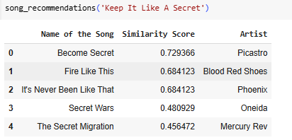
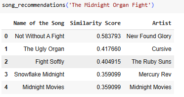
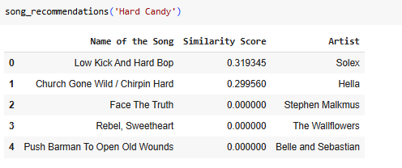
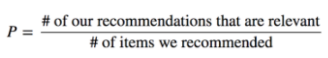

# 🎧 Laporan Proyek Sistem Rekomendasi Lagu Berbasis Content-Based Filtering  
**Nama:** Taufik Alwan  

---

## 📘 Business Understanding

### 📌 Latar Belakang
Di tengah pesatnya pertumbuhan konten digital, kebutuhan akan sistem yang mampu menyajikan informasi yang relevan menjadi sangat penting. Salah satu solusi dari permasalahan ini adalah sistem rekomendasi, yang dirancang untuk memberikan saran konten secara otomatis kepada pengguna berdasarkan preferensi, histori interaksi, atau kemiripan konten. Dalam konteks musik digital, sistem rekomendasi membantu pengguna menemukan lagu-lagu yang sesuai dengan selera mereka tanpa harus mencarinya secara manual.

### ⚠️ Permasalahan Bisnis
Tanpa adanya sistem rekomendasi, pengguna akan kesulitan dalam menelusuri dan menemukan lagu yang sesuai dengan selera mereka dari jutaan konten yang tersedia. Hal ini dapat menurunkan tingkat kepuasan pengguna dan menyebabkan mereka beralih ke platform lain yang menawarkan pengalaman yang lebih personal.

### 🎯 Tujuan Proyek
Proyek ini bertujuan untuk membangun sebuah sistem rekomendasi lagu yang efektif dan akurat menggunakan pendekatan *Content-Based Filtering*. Sistem ini diharapkan mampu merekomendasikan lagu-lagu baru yang mirip dengan lagu yang sebelumnya disukai oleh pengguna berdasarkan karakteristik kontennya, seperti nama lagu atau genre.

### 💼 Manfaat Bisnis
Penerapan sistem rekomendasi dalam aplikasi streaming musik atau platform audio lainnya memiliki sejumlah manfaat bisnis, antara lain:
- **Meningkatkan keterlibatan pengguna**, karena mereka merasa konten yang disajikan lebih relevan dan personal.
- **Memperpanjang waktu penggunaan aplikasi**, karena pengguna menemukan lagu baru tanpa usaha tambahan.
- **Meningkatkan loyalitas dan retensi pengguna**, yang berdampak langsung pada pertumbuhan platform dan keuntungan bisnis secara keseluruhan.

---

## 🎯 Tujuan Penelitian

Berdasarkan rumusan masalah yang telah dikemukakan, tujuan dari penelitian ini adalah sebagai berikut:

1. **Mengembangkan sistem rekomendasi lagu menggunakan pendekatan Content-Based Filtering.**  
2. **Menganalisis performa sistem dalam memberikan saran lagu yang relevan berdasarkan kemiripan konten.**

---

## 🧠 Pendekatan Solusi

Untuk menjawab permasalahan yang telah diidentifikasi, penelitian ini menggunakan pendekatan *Content-Based Filtering* dalam membangun sistem rekomendasi lagu.  
Sistem ini bekerja dengan menganalisis karakteristik dari lagu-lagu yang pernah disukai oleh pengguna, dan kemudian merekomendasikan lagu lain yang memiliki kemiripan konten. Kemiripan ini dapat dihitung menggunakan teknik seperti **TF-IDF**, **cosine similarity**, atau metode representasi teks lainnya pada fitur seperti **judul lagu**.

Proses pengembangan sistem dilakukan melalui beberapa tahapan penting, meliputi:

- Pengumpulan dan pengolahan data,  
- Ekstraksi dan representasi fitur lagu,  
- Penghitungan kesamaan antar konten, dan  
- Evaluasi performa rekomendasi menggunakan metrik yang sesuai.

Pendekatan ini diharapkan mampu memberikan pengalaman yang lebih personal kepada pengguna dalam menemukan musik yang sesuai dengan selera mereka.

---

---

## Data Understanding


Adapun variabel-variabel yang terdapat dalam dataset tersebut antara lain:

* **Name of the Song**: Berisi nama atau judul dari masing-masing lagu.
* **Artist**: Menunjukkan nama artis atau penyanyi dari lagu tersebut.
* **Date of Release**: Mencatat tanggal resmi perilisan lagu.
* **Description**: Berisi deskripsi atau ringkasan informasi mengenai lagu, termasuk genre, tema, atau narasi umum.
* **Metascore**: Merupakan skor evaluasi rata-rata yang diberikan oleh para kritikus musik terhadap lagu tersebut.
* **User Score**: Menunjukkan skor atau penilaian dari pengguna umum berdasarkan preferensi dan pengalaman mereka terhadap lagu.

Pemahaman terhadap struktur dan isi dari dataset ini menjadi langkah awal yang krusial dalam proses analisis, pemodelan, serta pengembangan sistem rekomendasi lagu berbasis *machine learning*.

---
---

Untuk memahami kondisi awal dataset, beberapa fungsi eksploratif pada *Pandas* digunakan:

* `df.info()` memberikan gambaran umum tentang struktur dataset, termasuk jumlah baris dan kolom, tipe data tiap kolom, serta jumlah nilai non-null.
* `df.isnull().sum()` digunakan untuk mengidentifikasi jumlah nilai kosong (*missing values*) pada setiap kolom.
* `df.duplicated().sum()` digunakan untuk memeriksa jumlah duplikasi baris secara keseluruhan dalam dataset.
* `df.duplicated(subset=['Name of the Song']).sum()` mengecek jumlah lagu yang memiliki judul yang sama, untuk mengetahui potensi duplikasi berdasarkan nama lagu.

Berdasarkan eksplorasi awal, diperoleh hasil sebagai berikut:

* **Jumlah total entri** dalam dataset adalah **198.126 baris**.
* **Missing values** ditemukan pada beberapa kolom:

  * `Description`: terdapat **4.369** data kosong.
  * `Metascore`: terdapat **24.385** data kosong.
  * `User Score`: terdapat **49.281** data kosong.
* **Jumlah baris yang duplikat secara keseluruhan**: **0** baris (tidak ditemukan duplikasi identik pada seluruh baris).
* **Jumlah lagu dengan nama judul yang duplikat**: sebanyak **194.214 lagu**, menunjukkan bahwa banyak lagu memiliki judul yang sama, kemungkinan besar berasal dari artis atau versi yang berbeda.

Temuan ini menjadi landasan penting untuk proses *data cleaning* dan validasi data sebelum melanjutkan ke tahap pemodelan.

---
### Visualisasi Data
Beberapa teknik visualisasi digunakan untuk memahami distribusi data antara lain:
- **Histogram**: Digunakan untuk melihat distribusi frekuensi data dalam tiap variabel.


---
### Data Preparation.
---
Sebelum masuk ke tahap pemodelan, data perlu dipersiapkan dan dibersihkan agar sesuai dengan kebutuhan algoritma *machine learning*, khususnya untuk sistem rekomendasi berbasis **Content-Based Filtering** 

### 🔧 Langkah-langkah Data Preparation:

1. **Menghapus Data yang Tidak Lengkap (Missing Values)**
   Data yang memiliki nilai kosong dihapus menggunakan fungsi `dropna()`. Hal ini penting untuk menjaga kualitas data dalam proses pelatihan model.

2. **Menghapus Duplikasi Berdasarkan Judul Lagu**
   Untuk menghindari redudansi pada hasil rekomendasi, data duplikat berdasarkan kolom **Name of the Song** dihapus menggunakan `drop_duplicates()`.

```python
# Menghapus missing values dan duplikasi berdasarkan judul lagu
df_songs.dropna(inplace=True)
df_songs.drop_duplicates(subset=['Name of the Song'], inplace=True)

# Menampilkan jumlah data setelah dibersihkan
print(f"Jumlah data setelah dibersihkan: {len(df_songs)} baris")
```

3. **Pembersihan Kolom Artist**
   Ditemukan bahwa pada kolom `Artist`, nama artis sering diawali dengan kata **"by"** (misalnya: `"by Taylor Swift"`). Untuk menjaga konsistensi dalam analisis teks dan pencocokan string, kata “by” dihapus menggunakan *regular expression*.

```python
# Salin data ke dataframe baru untuk proses encoding/pembersihan
df_songs_encode = df_songs.copy()

# Bersihkan kolom 'Artist' dengan menghapus kata 'by' di awal jika ada
df_songs_encode['Artist'] = df_songs_encode['Artist'].str.replace(r'^by\s+', '', regex=True).str.strip()

# Tampilkan hasil dataframe yang telah diproses
display(df_songs_encode.head())
```
* Setelah proses pembersihan, diperoleh **2.537 entri data lagu** dengan **7 atribut** yang siap digunakan untuk pemodelan.
* Proses pembersihan kolom `Artist` bertujuan menghindari kesalahan dalam analisis atau pencocokan nama artis.
* Dengan data yang bersih dan terstruktur, proses *Content-Based Filtering* dan *Collaborative Filtering* dapat dilakukan secara optimal dan akurat.
---
---
Data preparation untuk Content Base Filtering didasari pada :

- Membuang atribut **Description, Unnamed: 0, dan Date of Release**. Tujuan dari pembuangan atribut ini untuk mempersiapkan atribut yang akan digunakan pada proses CBF.
- TF-IDF digunakan untuk mengubah judul lagu menjadi representasi numerik.
  
```python
# Salin ulang data hasil pembersihan nama artis
df_songs = df_songs_encode.copy()

# Kolom yang ingin dihapus
drop_columns = ['Description', 'Unnamed: 0', 'Date of Release']

# Hapus kolom jika memang ada dalam DataFrame
df_songs.drop(columns=[col for col in drop_columns if col in df_songs.columns], inplace=True)

# Tampilkan hasil
display(df_songs)
```

Langkah-langkah berikut dilakukan untuk membersihkan dan menyederhanakan dataset sebelum masuk ke tahap pembuatan sistem rekomendasi berbasis *Content-Based Filtering*:

**Menyalin Data Bersih**  
   Data hasil pembersihan kolom 'Artist' (`df_songs_encode`) disalin kembali ke DataFrame `df_songs`. Hal ini bertujuan agar proses lanjutan tidak mengubah data asli, serta memastikan data yang digunakan adalah versi yang telah dibersihkan.

**Menentukan Kolom yang Akan Dihapus**  
   Kolom-kolom seperti:
   - `Description`: berisi teks panjang yang tidak dibutuhkan dalam pemodelan,
   - `Unnamed: 0`: kolom auto-generated dari file CSV,
   - `Date of Release`: kolom waktu yang tidak dianalisis dalam sistem ini,

   dikumpulkan ke dalam list `drop_columns` untuk dihapus.

**Menghapus Kolom dengan Aman**  
   Kolom-kolom dalam `drop_columns` dihapus dari DataFrame hanya jika kolom tersebut memang ada. Ini mencegah terjadinya error saat kolom tidak ditemukan.

**Menampilkan Data yang Telah Dibersihkan**  
   Data akhir ditampilkan untuk memastikan hasilnya sudah sesuai, hanya menyisakan kolom-kolom penting yang akan digunakan untuk proses rekomendasi, seperti `Title` dan `Artist`.

---

- **`TfidfVectorizer(stop_words='english')`**  
  Digunakan untuk menghilangkan kata-kata umum (seperti "the", "of", "and") agar hanya kata penting yang digunakan sebagai fitur.

- **`fit_transform(df_songs['Name of the Song'])`**  
  Melatih dan mentransformasi kolom judul lagu menjadi matriks TF-IDF.

- **`tfidf_matrix.shape` → (2537, 2858)**  
  Artinya ada **2.537 lagu unik** yang direpresentasikan oleh **2.858 kata unik** yang muncul pada judul lagu (setelah dibersihkan dan difilter).

- **`tfidf_matrix.todense()`**  
  Mengubah representasi sparse matrix (hemat memori) ke dense matrix agar dapat dilihat dan dianalisis secara eksplisit.
  
```python
# Inisialisasi TF-IDF Vectorizer
tfidf_vectorizer = TfidfVectorizer(stop_words='english')  # stop_words digunakan untuk menghilangkan kata umum yang tidak penting

# Transformasi kolom 'Name of the Song' menjadi representasi TF-IDF
tfidf_matrix = tfidf_vectorizer.fit_transform(df_songs['Name of the Song'])

# Menampilkan ukuran matriks TF-IDF (baris = jumlah lagu, kolom = jumlah fitur unik dari judul lagu)
print(f"Ukuran TF-IDF Matrix: {tfidf_matrix.shape}")
```

## Modeling and Result
Proses modeling memuat proses perancangan model yang digunakan dalam rekomendasi.

```python
# Menghitung Cosine Similarity dari matrix TF-IDF
cosine_sim = cosine_similarity(tfidf_matrix, tfidf_matrix)
# Menampilkan ukuran matriks kemiripan (harus persegi: jumlah lagu x jumlah lagu)
print(f"Ukuran matriks Cosine Similarity: {cosine_sim.shape}")
```

### Solusi - Top 5 rekomendasi pada teknik Content Base Filtering
- Membuat DataFrame dari matriks cosine similarity
Cosine similarity digunakan untuk mengukur tingkat kemiripan antara satu lagu dengan lagu lainnya berdasarkan vektor TF-IDF dari judul lagu. Hasil dari perhitungan ini adalah matriks simetri berukuran n x n, di mana n adalah jumlah lagu. Setiap nilai dalam matriks menunjukkan tingkat kemiripan antara dua lagu. Untuk memudahkan pencarian dan penyajian rekomendasi, matriks ini kemudian diubah menjadi sebuah DataFrame, sehingga setiap lagu dapat dihubungkan langsung dengan skor kemiripannya terhadap lagu lainnya. Baris dan kolom menggunakan nama lagu untuk kemudahan interpretasi

```python
cosine_sim_df = pd.DataFrame(
    cosine_sim,
    index=df_songs['Name of the Song'],
    columns=df_songs['Name of the Song']
)
```
Menampilkan ukuran dari DataFrame hasil cosine similarity
- DataFrame ini sangat penting dalam proses rekomendasi.
- Contoh: Jika pengguna menyukai lagu A, maka sistem dapat merekomendasikan lagu-lagu lain yang memiliki nilai cosine similarity tinggi terhadap lagu A.
```python
print(f" Ukuran DataFrame cosine similarity: {cosine_sim_df.shape}")
```
Menampilkan 10 sampel baris dan 10 kolom dari cosine similarity matrix
```python
cosine_sim_df.sample(n=10, axis=0).sample(n=10, axis=1)
```
Fungsi `song_recommendations()` digunakan untuk memberikan rekomendasi lagu-lagu yang memiliki kemiripan tertinggi berdasarkan **judul lagu**, menggunakan pendekatan **Content-Based Filtering (CBF)** dengan perhitungan **Cosine Similarity**.
```python
def song_recommendations(target_song, similarity_data=cosine_sim_df, items=df_songs[['Name of the Song', 'Artist']], k=5):
    if target_song not in similarity_data.columns:
        raise ValueError(f"Lagu '{target_song}' tidak ditemukan dalam data.")
    similar_scores = similarity_data[target_song].sort_values(ascending=False)[1:k+1]
    recommendations = pd.DataFrame(similar_scores).reset_index()
    recommendations.columns = ['Name of the Song', 'Similarity Score']
    recommendations = recommendations.merge(items, on='Name of the Song')
    return recommendations
```

### 🎵 Hasil Rekomendasi Menggunakan *Content-Based Filtering*

Melalui pendekatan *Content-Based Filtering*, sistem menghasilkan rekomendasi lagu berdasarkan kemiripan kata yang terkandung dalam judul lagu yang dicari oleh pengguna. Sistem ini akan menampilkan **5 lagu terdekat** yang memiliki kesamaan konten tertinggi dengan lagu referensi.

* 
* 
* 
  
---

## 🔍 Evaluation
```python
Evaluasi dilakukan dengan mengukur precision, yaitu seberapa tepat rekomendasi yang diberikan oleh model.
Penghitungan precision ini dilakukan melalui perintah tertentu dalam kode.
# Fungsi tokenisasi: ubah teks menjadi kumpulan kata unik (huruf kecil, tanpa tanda baca)
def tokenisasi(teks):
    return set(re.findall(r'\b\w+\b', teks.lower()))

# Fungsi untuk mengukur presisi rekomendasi berdasarkan token judul lagu
def presisi_untuk_lagu_acak(data_lagu, matriks_similarity, k=3):
    # Pilih lagu target secara acak
    lagu_target = data_lagu['Name of the Song'].drop_duplicates().sample(n=1).values[0]
    print(f"Lagu target yang dipilih secara acak: **{lagu_target}**")

    # Validasi: pastikan lagu target tersedia dalam matriks similarity
    if lagu_target not in matriks_similarity.columns:
        print(f" Lagu '{lagu_target}' tidak ditemukan dalam matriks similarity.")
        return None, None

    # Ambil top-k rekomendasi
    try:
        rekomendasi_df = song_recommendations(lagu_target, similarity_data=matriks_similarity, k=k)
    except Exception as e:
        print(f" Terjadi kesalahan saat mengambil rekomendasi: {e}")
        return None, None

    # Tokenisasi judul lagu target
    token_target = tokenisasi(lagu_target)
    if not token_target:
        print(f" Judul lagu target '{lagu_target}' tidak memiliki token yang valid.")
        return None, None

    # Evaluasi kesamaan token dengan lagu hasil rekomendasi
    jumlah_relevan = sum(
        bool(token_target & tokenisasi(judul))
        for judul in rekomendasi_df['Name of the Song']
    )

    # Hitung nilai presisi
    presisi = jumlah_relevan / k
    print(f"\n Presisi rekomendasi untuk lagu '{lagu_target}': **{presisi:.2f}**")

    # Tambahkan kolom target ke hasil
    rekomendasi_df.insert(0, "Judul Lagu Target", lagu_target)
```
---

## Penjelasan Fungsi Evaluasi Presisi Rekomendasi

### 1. Fungsi `tokenisasi(teks)`

Fungsi ini mengubah teks menjadi kumpulan kata unik:

* Semua huruf diubah menjadi huruf kecil.
* Tanda baca dihilangkan.
* Hasilnya adalah *set* kata.

Contoh: `"I Love You!"` → `{"i", "love", "you"}`

---

### 2. Fungsi `presisi_untuk_lagu_acak()`

Digunakan untuk menghitung **presisi rekomendasi lagu** berdasarkan kemiripan kata dalam judul lagu.

Langkah-langkah prosesnya:

1. Memilih **satu lagu secara acak** dari data.
2. Memastikan lagu tersebut tersedia di **matriks similarity**.
3. Mengambil **rekomendasi top-*k*** lagu yang paling mirip.
4. Melakukan **tokenisasi** pada judul lagu target dan judul lagu-lagu yang direkomendasikan.
5. Menghitung **jumlah rekomendasi yang relevan**, yaitu yang memiliki minimal satu kata yang sama dengan lagu target.
6. Menghitung **nilai presisi** sebagai:
7. Menampilkan nilai presisi dan tabel rekomendasi.

### 🎵 **Hasil Rekomendasi Lagu Berdasarkan Kesamaan Judul**

Lagu target yang dipilih secara acak: Summer Of Hate
(**Bisa berubah2 jika dijalan kan ulang**)

**Presisi rekomendasi untuk lagu ini: 1.00**

#### Contoh Top-5 Lagu yang Direkomendasikan:

| No | Judul Lagu Rekomendasi  | Similarity Score | Artist                |
| -- | ----------------------- | ---------------- | --------------------- |
| 1  | Hate                    | 0.739            | The Delgados          |
| 2  | Summer Sun              | 0.497            | Yo La Tengo           |
| 3  | Summer In Abaddon       | 0.440            | Pinback               |
| 4  | Summer In The Southeast | 0.440            | Bonnie "Prince" Billy |
| 5  | How I Long To Feel...   | 0.349            | Gorky’s Zygotic Mynci |
---
---


### **Kesimpulan**

- Content-Based Filtering tergolong lebih mudah diimplementasikan karena hanya memanfaatkan **TF-IDF** dan **cosine similarity** untuk menghitung kemiripan judul lagu. Dari hasil evaluasi, metode ini menghasilkan **presisi sebesar 1.00** atau **100%**, yang menunjukkan bahwa semua rekomendasi yang diberikan sangat relevan dengan lagu target.


